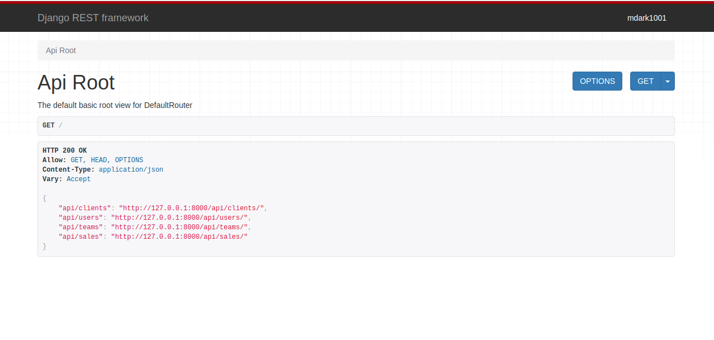

# Sales API DRF


Una implementación de una API RestFul usando Django y Django Rest Framework (DRF)

Los endpoints contiene el API:

- Clientes 
- Usuarios 
- Equipos
- Ventas

#### ¿Cómo funciona?

Después de clonar el proyecto, usar los siguientes  comandos:

```bash
$ virtualenv .env 
$ source .env/bin/active
(.env)$ pip install -r requirements.txt
```

Con eso se instalarán las dependencias. Para levantar el servidor

```bash
$ python manage.py migrate; python manage.py runserver
```

Al ingresar al api-root podemos observar lo siguiente:

